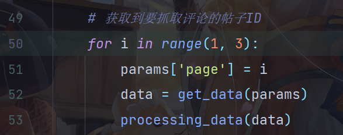

# 使用说明

## ajax获取数据

直接运行main.py文件即可获取数据

通过修改141行代码的数字, 可以控制抓取的数量.

每页数据获取到的ID大概在20条左右.

## 使用selenium自动化获取数据

+ 首先运行get_mid.py, 获取到文章的mid.
+ 运行wb_selenium通过mid拼接url获取帖子的详细信息.

通过修改代码50行的数据, 控制获取数据量的多少.